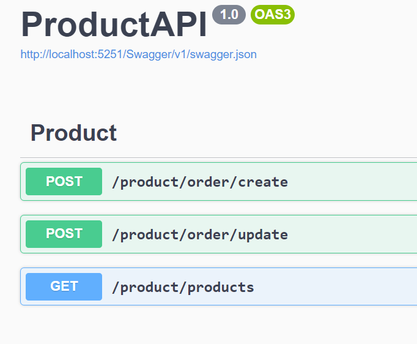

# MiddlewareServices_GPRC_RabbitMQ
This Project demonstrates a microservices architecture with services for Product, Order, and Notification using RabbitMq and gRPC for communication.

# **Pre-requisites and assumptions**
Following softwares should be installed
- .NET 8
- Docker
- RabbitMq server running 

 
  Start RabbitMQ on docker you can refer https://www.architect.io/blog/2021-01-19/rabbitmq-docker-tutorial
  ``` Docker commands used are
  - docker pull rabbitmq:3-management
  - docker run --rm -it -p 15672:15672 -p 5672:5672 rabbitmq:3-management
  ```


# Steps to run the solution:
1. Clone the project.
2. Start RabbitMQ on Docker.
3. On the root clone folder there is bat file . Run that inside command line.
`.\start.bat` .This will open all 4 application in 4 different cmd window. All the window will be set with respective app title.
4. Open ProductApi app window. copy port-number of the ProductApi swagger. 
 ``` example :: 'http://localhost:5251/Swagger' ```
